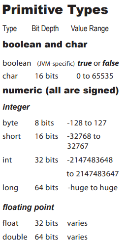

# Chapter 3: Know Your Variables

Variables can store two types of things:

- primitives
- references

## Primitives

### Primitive types



When assigning a value to a variable, **long** and **float** types are **special**. For example:

```java
long big = 3456789L;
float f = 32.5f;
```

We have to add **L** and **f** to tell the compiler that these are **long** and **float** type, or it might get confused between similar-looking number types. We can use **upper** or **lowercase**.

### Spillage

The compiler tries to help prevent spillage if it can tell from your code that you are trying to put a **big-range-type number** into a **small container**. For example:

```java
int x = 24;
byte y = x; // Error: incompatible types
```

### Name a variable

following below rules will keep you safe to use as names for your variables:

- It must start with a **letter**, **underscore `_`**, or **dollar sign `$`**.
- Subsequent characters could be numbers.But just **don't** start with a **number**.
- You **cannot** use a Java **reserved words**.

reserved words include:  
**public** **static** **void**  
and the primitive types are reserved as well:  
**boolean** **char** ...

We **DO NOT** need to try to memorize these now *under any circumstances*. by the end of this book, you'll have most of them down.

## References

The object references variable doesn't hold the object itself, but it **holds** something like a **pointer** or an **address** that tells the JVM where to find the object. We don't care how JVM implements object references.

So, we say, "There's **no object variable**. There's only an **object reference variable**."

## Object references size

In **the same one** JVM, **all object references** are the **same size** regardless of the objects they reference, but in different JVM object references might have different sizes.

## Life and death on the heap

An object is abandoned and eligible for Garbage Collection when there are no more references to it.  
A reference is eligible for Garbage Collection when it's set to null.

## Array

Regardless of what array holds, the array itself is always an object!
