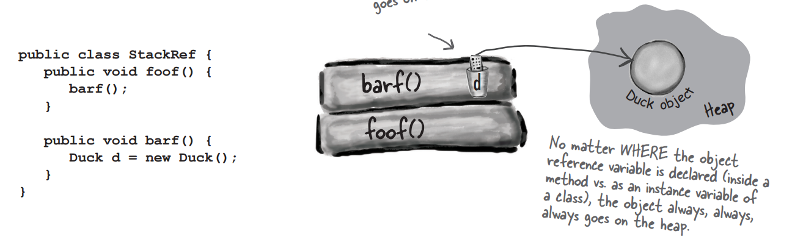

# Chapter 9: Life and Death of an Object

Java has two areas of memory we care about:

## The Stack and the Heap

The method invocations and local variables live int the stack, while **ALL** objects live in the heap.

### The Stack

If method `foo()` calls method `bar()`, the method `bar()` lands on the top of a call stack, and the method `foo()` is below it. Actually, it's the stack frame that pushed onto the stack. The stack frame contains the local variables and the return address of the method.

### What if local variables are objects?

If the local variables is a reference to an object, the reference is stored in the stack, but the object itself is stored in the heap.



### The Heap

The instance variables of an object live in the heap. For the primitive types, Java makes space in the heap for the value of the variable. But for the reference types, Java makes space in the heap for the reference to the object, but not the object itself. When the object is created, Java makes space for it in the heap.

## Constructor Chaining

When a subclass constructor is called, it must, explicitly or implicitly, call the constructor of its superclass. This is called **constructor chaining**.

```java
public class Animal {
    public Animal() {
        System.out.println("Making an Animal");
    }
}

public class Hippo extends Animal {
    public Hippo() {
        // super(); 
        // The compiler will insert the line if you don't
        System.out.println("Making a Hippo");
    }
}

public class TestHippo {
    public static void main(String[] args) {
        System.out.println("Starting...");
        Hippo h = new Hippo();
    }
}
```

```bash
$ java TestHippo
Starting...
Making an Animal
Making a Hippo
```

If you explicitly call the super(), the `super();` MUST be the FIRST LINE of the subclass constructor. If you put the call to super() below anything else, this won't compile!

And, this is the same for the call to this(). The call to this() must be the first line of the constructor.

Thus, you CAN'T call both super() and this() in the same one constructor.
